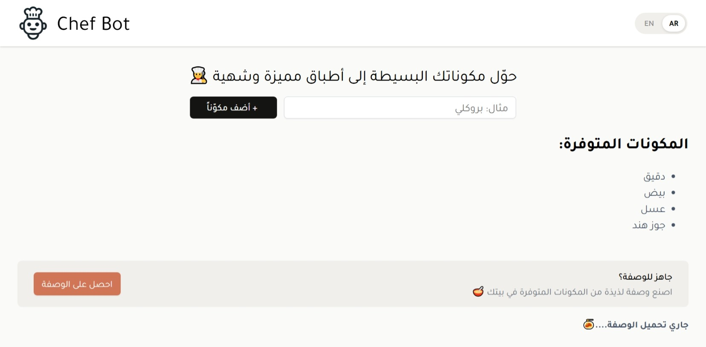

# Chef Bot 👩‍🍳

An AI-powered recipe assistant that suggests recipes based on ingredients you have at home. Supports both English and Arabic.



## Features

- 🤖 AI recipe suggestions powered by Groq (LLaMA 3.3)
- 🌍 Bilingual support — English & Arabic (with RTL layout)
- ✅ Duplicate and empty ingredient validation
- 📱 Responsive design — mobile first
- ⚡ Smooth scroll to recipe on generation

## Tech Stack

- **React** (Vite)
- **Groq SDK** — LLaMA 3.3 70B model
- **react-markdown** — renders AI response as formatted markdown

## Getting Started

### 1. Clone the repo

```bash
git clone https://github.com/your-username/chef-bot.git
cd chef-bot
```

### 2. Install dependencies

```bash
npm install
```

### 3. Set up environment variables

Create a `.env` file in the root of the project:

```
VITE_GROQ_API_KEY=your_groq_api_key_here
```

You can get a free API key from [console.groq.com](https://console.groq.com)

### 4. Run the development server

```bash
npm run dev
```

## Project Structure

```
src/
├── assets/
├── components/
│   ├── Header/
│   │   ├── Header.jsx
│   │   └── Header.css
│   ├── IngredientsList/
│   │   ├── IngredientsList.jsx
│   │   └── IngredientsList.css
│   └── Recipe/
│       ├── Recipe.jsx
│       └── Recipe.css
├── services/
│   └── ai.js          # Groq API integration
├── translations.js    # EN & AR strings
├── App.jsx
├── App.css
├── index.css          # Global styles & CSS variables
└── main.jsx
```

## Usage

1. Type an ingredient into the input field and click **Add Ingredient**
2. Add at least 3 ingredients to unlock the **Get a Recipe** button
3. Chef Bot will suggest a recipe using your ingredients
4. Click **Start Over** to reset and add a new ingredients list

## Notes

> ⚠️ The Groq API key is used client-side for demo purposes only.
> In a production app, API calls should be handled through a backend to protect the key.

---
🔗 **Live Demo:** [Chef Bot App](https://claude-chef.hagarsamy.workers.dev/)